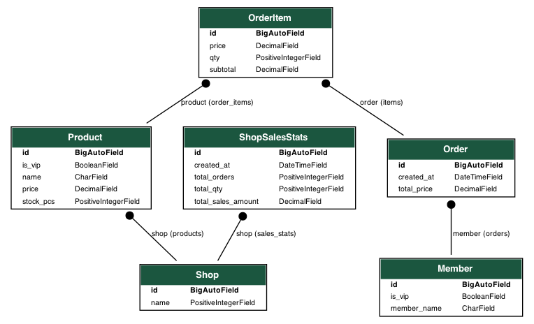

## quiz

### 專案介紹：
1. 透過 Django Rest Framework產出 api
2. 可以進行訂單查詢、查詢、刪除、查看最熱賣的三項商品、每日0:00會自動計算當日的營收，並產出csv檔
3. 使用 Pytest 撰寫單元測試

### 使用技術：Django、Django Rest Framework、Celery、Redis(Celery's broker)、Pytest


---
### 操作指南：

#### 1. 使用``` poetry install``` 下載專案所需的內容
#### 2. ```poetry shell```  進入專案的虛擬環境
#### 3.執行```python manage.py runserver``` 或者 ```python3 manage.py runserver ```讓專案跑起來
#### 4. 啟動排程功能，結合 celery + redis (broker)
#### 5.```redis-server``` 啟動 redis (排程啟動時不能關掉)
#### 6.另開一個終端機啟動 celery-beat ```celery -A core beat --loglevel=info```
#### 7.再另開一個終端機 執行 celery worker ```Celery -A core worker --concurrency=4 -l info -P eventlet```

---

### model 關係圖


